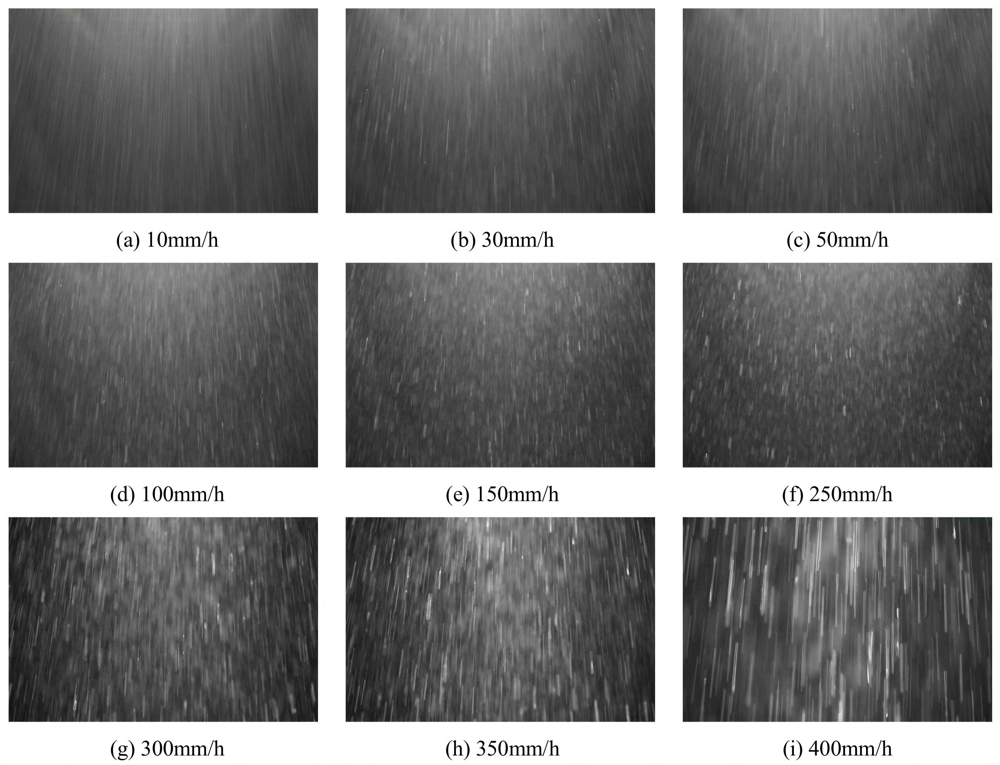
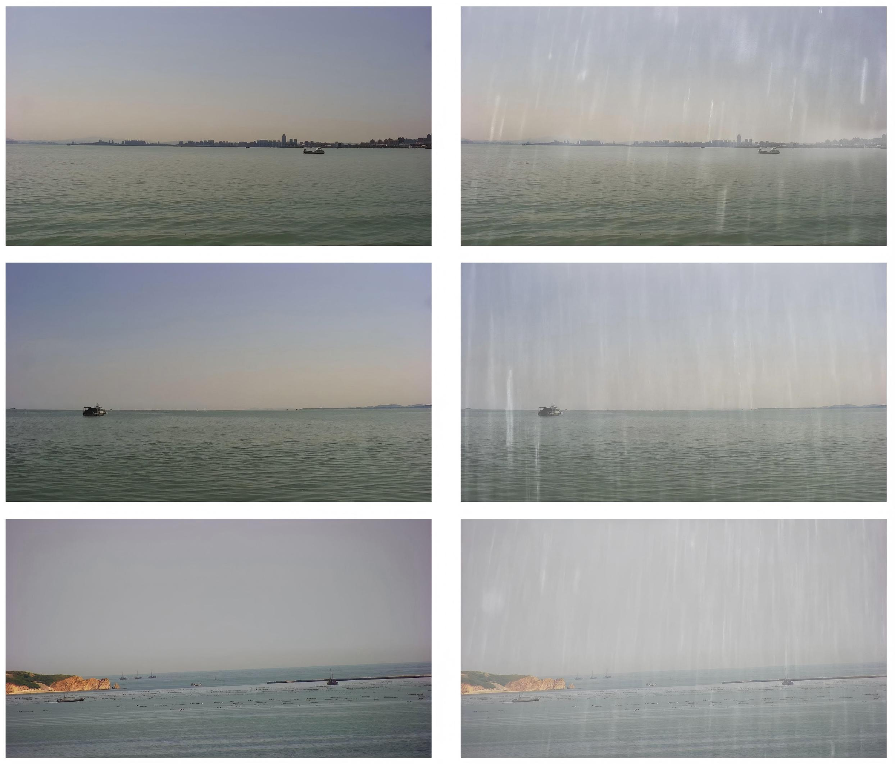
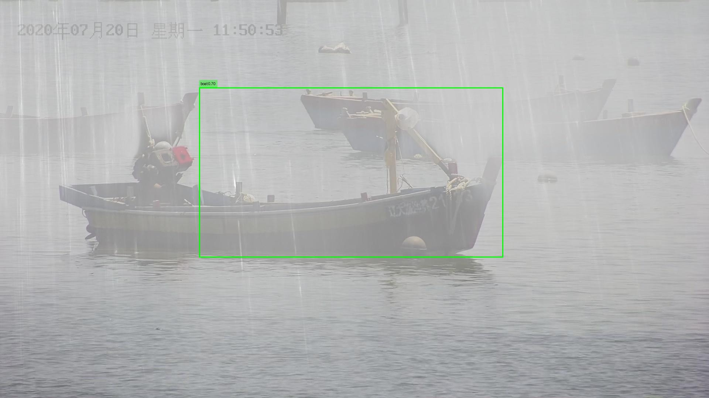
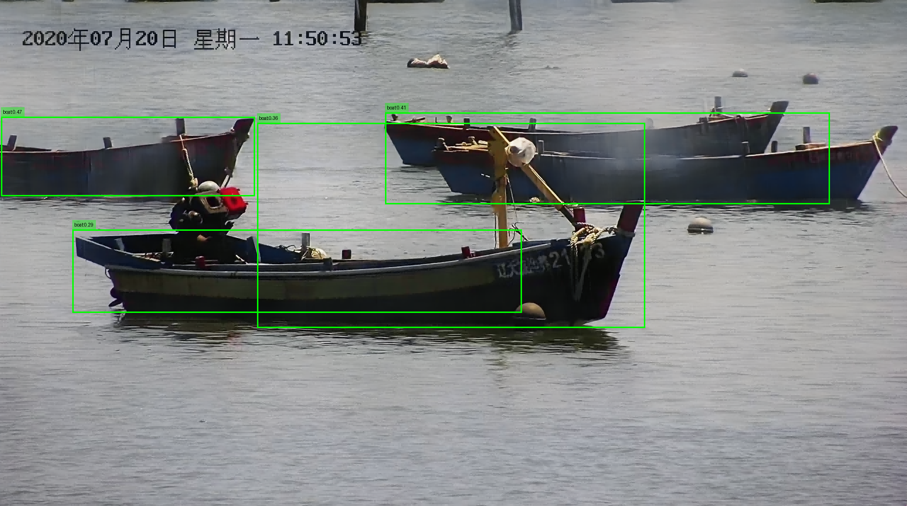

<h1><strong>From Real Rain Streaks to Physically Grounded Marine Rain-Fog
Images: The MarineRain Benchmark</strong></h1>
  

    面向海洋场景的雨雾退化图像复原基准：<b>8.5k 配对 rain-fog/clean</b> + <b>2k 真实雨纹层库</b>
  

## 📋 项目概述

**MarineRain** 是一个面向海洋/水面环境（ocean–lake–river 等）**雨雾退化图像复原**（single-image rain-fog removal / restoration）的数据集与评测基准。  
本项目包含两个互补子集：

- **RealRain-2k**：基于可控雨雾模拟舱采集的 **2,000 张真实雨纹层（real rain streak layers）**，通过雨强、曝光时间与色温进行细粒度可控采集，用于为合成与算法研究提供高真实性雨纹先验。
- **MarineRain-8k**：构建的 **8,500 对配对（rain-fog / clean）海洋雨雾图像**，通过“真实雨纹层 + 单目深度估计 + 大气散射模型”生成**物理一致、半真实（semi-realistic）**的海洋雨雾退化样本，用于训练与评测各类复原模型，并验证对**下游船舶检测**的增益。
---

## 🎯 设计方法

### 核心设计理念

MarineRain 的数据构建遵循以下原则：

1. **真实雨纹驱动（Real Rain Streaks as Building Blocks）**
   - 使用可控模拟舱采集真实雨纹层，避免仅用合成 streak 造成的纹理单一与失真
   - 覆盖不同雨强、曝光与色温组合，增强雨纹形态多样性与可控性

2. **物理一致的雨雾耦合退化（Physically Grounded Rain-Fog Model）**
   - 基于单目深度估计获得场景深度
   - 将雨纹随深度衰减与雾散射（透射率）耦合，形成更贴近海上远距离成像的退化规律（近处雨纹更显著、远处雾幕更强）
     
3. **海洋任务导向（Maritime-Oriented Benchmark）**
   - 以海洋/水面视觉任务为目标（如船舶目标检测）
   - 不仅报告复原指标，也通过下游检测性能验证数据集的工程价值

4. **可复现与可扩展（Reproducible & Extensible）**
   - 提供明确的数据划分与生成流程说明
   - 支持后续扩展更多背景、更多真实天气采集与更复杂退化类型

### 数据统计

| 子集 | 内容 | 数量 | 备注 |
|------|------|------|------|
| RealRain-2k | 真实雨纹层库（real rain streak layers） | 2,000 | 来自可控雨雾模拟舱采集 |
| MarineRain-8k | 配对 rain-fog / clean 海洋雨雾图像 | 8,500 对 | Train: 8,000 / Test: 500 |

**可控采集因素（RealRain-2k）**  
- 雨强：10–400 mm/h（40 档，步长 10）  
- 曝光：1–100 ms（多档设置，用于覆盖雨滴点/短 streak/长 streak 等形态）  
- 色温：3000–6000 K（步长 1000 K）

---

## 📸 数据集示例

### 1.RealRain-2k 真实雨纹层（Real Rain Streak Layer）

  

**说明：**  
雨线图来自模拟舱采集的真实雨纹层，雨纹形态随雨强与曝光设置呈现显著差异，可用于构建更真实的合成退化或作为雨纹先验参考。

---

### 2.MarineRain-8k 配对样本（Rain-Fog / Clean Pair）

  

**说明：**  
每个样本包含一对 **rain-fog 退化图像**与其对应的 **clean 图像**，用于监督训练与客观指标评测（如 PSNR / SSIM）。退化由真实雨纹层叠加并与深度相关的雾散射一致耦合生成。

---

### 3.下游船舶检测增益（Before/After Restoration for Ship Detection）

  <table>
    <tr>
      <td align="center" width="50%">
        
        
<b>雨雾海洋图像目标检测</b>

      </td>
      <td align="center" width="50%">
        
        
<b>雨雾海洋图像恢复后目标检测</b>

      </td>
    </tr>
  </table>

 

在雨雾退化条件下，复原模型输出的更清晰图像可提升下游船舶检测的置信度与检测效果，从而体现 MarineRain 在真实海洋视觉任务中的应用价值。

---
